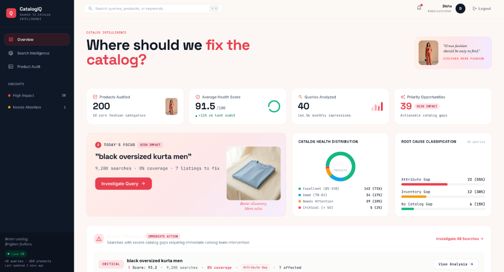
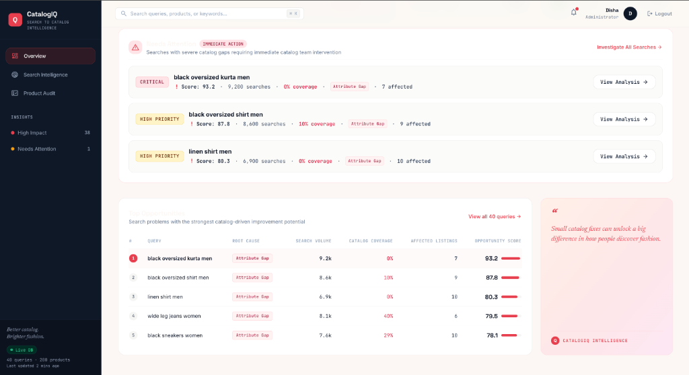
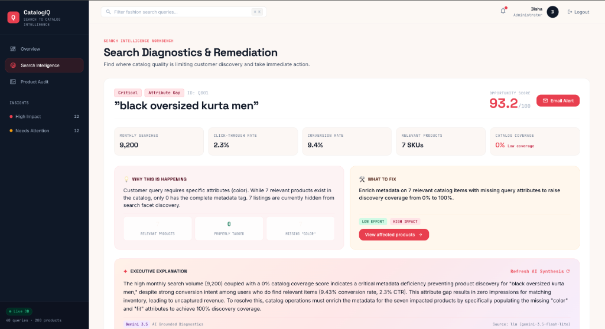

# CatalogIQ

**Catalog intelligence for better search.**

CatalogIQ is an e-commerce catalog intelligence platform designed around the catalog and search challenges faced by large fashion marketplaces. It identifies search friction caused by catalog quality gaps, traces the root cause, prioritizes the highest-impact issues, and recommends actionable catalog fixes.

It connects customer search demand with product catalog quality to answer one practical question:

> **Which catalog problems are preventing customers from finding what they want, and which fixes should the catalog team prioritize first?**

🔗 **Live demo:** [catalogiq-c4cr.onrender.com](https://catalogiq-c4cr.onrender.com)
📄 **Demo access:** see [Demo Access](#demo-access) below

---

## Screenshots

**Catalog Overview** — health score, priority opportunities, root-cause distribution, and today's highest-impact query at a glance.



**Top Opportunities** — every underperforming query ranked by opportunity score, with root cause, search volume, and coverage side by side.



**Search Diagnostics & Remediation** — full drill-down for a single query: why it's happening, what to fix, and an LLM-generated executive explanation.



---

## Table of Contents

- [Screenshots](#screenshots)
- [Problem](#problem)
- [Core Workflow](#core-workflow)
- [Key Capabilities](#key-capabilities)
- [Architecture](#architecture)
- [Technology Stack](#technology-stack)
- [Intelligence Architecture](#intelligence-architecture)
- [Root Cause Analysis](#root-cause-analysis)
- [Access Management](#access-management)
- [Security](#security)
- [Dataset](#dataset)
- [Project Structure](#project-structure)
- [Local Development](#local-development)
- [Testing](#testing)
- [Production Deployment](#production-deployment)
- [API Surface](#api-surface)
- [Engineering Decisions](#engineering-decisions)
- [Current Limitations](#current-limitations)
- [Future Architecture](#future-architecture)
- [Project Status](#project-status)
- [License](#license)

---

## Problem

Large fashion marketplaces operate catalogs with a very large number of products, while customer search behavior changes continuously. A search query can perform poorly even when relevant products technically exist in the catalog — the catalog may still fail to represent what the customer is actually asking for.

The core challenge isn't just identifying failed searches — it's connecting search demand back to the underlying catalog issue and determining what the catalog team should fix first.

```
Customer Search: "black oversized kurta men"
        │
        ▼
Intent Extraction → Catalog Matching → Coverage Analysis
        │
        ▼
Root Cause: Attribute Gap
        │
        ▼
Opportunity Score → Recommended Fix
```

Traditional catalog analytics and search analytics typically live in separate systems. CatalogIQ connects them — instead of simply reporting that a query underperforms, it explains:

- What the customer is looking for
- Whether the catalog represents that intent
- Which products are affected
- Why the query is underperforming
- How significant the opportunity is
- What the catalog team should fix

---

## Core Workflow

```
Customer Search
      ↓
Query Intent Extraction
      ↓
Search–Catalog Matching
      ↓
Coverage Analysis
      ↓
Root Cause Detection
      ↓
Affected Products
      ↓
Opportunity Scoring
      ↓
Recommended Fix
      ↓
Human-Readable Explanation
```

**Detect → Diagnose → Prioritize → Explain → Act**

---

## Key Capabilities

### 1. Catalog Overview
An executive-level dashboard summarizing catalog health and search opportunities: average catalog health, products requiring attention, search opportunities, root-cause distribution, search volume, search coverage, affected products, and opportunity score. Answers: *where should the catalog team focus first?*

### 2. Search Intelligence
Query-level investigation tracing each search from intent through to a recommended action:

```
Query → Intent → Catalog Match → Coverage → Root Cause → Affected Products → Opportunity → Recommended Action
```

**Example**

| Field | Value |
|---|---|
| Query | black oversized kurta men |
| Monthly search volume | 9,200 |
| Coverage | 0% |
| Root cause | Attribute Gap |
| Affected products | 7 |
| Opportunity score | 93.2 |

The application then generates a human-readable explanation of the diagnosis.

### 3. Product Audit
SKU-level catalog quality analysis — missing attributes, incomplete metadata, weak attribute representation, and other search-relevant gaps. Products can be inspected individually with their catalog metadata and product imagery.

---

## Architecture

```
                    Customer Search
                          │
                          ▼
                  Intent Extraction
        (category · color · fit · gender · material)
                          │
                          ▼
                  Catalog Matching
                  (Query ↔ Products)
                          │
            ┌─────────────┴─────────────┐
            ▼                           ▼
     Search Coverage             Catalog Health
            │                           │
            └─────────────┬─────────────┘
                           ▼
                      Root Cause
        (Attribute Gap · Inventory Gap · No Catalog Gap)
                           │
                           ▼
                  Opportunity Score
                           │
                           ▼
                   Recommended Fix
                           │
                           ▼
                   LLM Explanation
```

---

## Technology Stack

**Frontend** — HTML5, JavaScript, Tailwind CSS, responsive UI, same-origin API communication

**Backend** — Python, FastAPI, SQLAlchemy, SQLite, Pydantic, Uvicorn

**Intelligence** — Deterministic query-intent extraction, metadata-based catalog matching, catalog health scoring, search coverage analysis, root-cause classification, opportunity prioritization, Gemini-powered natural-language explanations

**Auth & Security** — Session-based authentication, PBKDF2-HMAC-SHA256 password hashing, cryptographically secure single-use activation tokens, time-limited account activation, protected routes

**Email** — Transactional email abstraction, HTTPS-based transport for production, SMTP for local development, access-request / approval / activation / admin-confirmation emails

**Deployment** — GitHub, Render, environment-based configuration

---

## Intelligence Architecture

A core engineering decision in CatalogIQ is keeping business-critical scoring **deterministic**. The LLM does not decide whether a catalog problem exists or generate the underlying metrics.

```
Raw Catalog + Search Data
          ↓
  Deterministic Analysis
          ↓
    Calculated Metrics
          ↓
       Root Cause
          ↓
   Opportunity Score
          ↓
    LLM Explanation
```

This gives reproducibility, explainability, easier testing, consistent scoring, lower hallucination risk, and a clean separation between business logic and language generation. The LLM's job is limited to translating calculated findings into a concise, human-readable explanation.

### Query Intent Extraction

Customer search queries are converted into structured attributes, e.g.:

```
"black oversized kurta men"
        ↓
{ "color": "black", "fit": "oversized", "category": "kurta", "gender": "men" }
```

These attributes are then compared against product metadata. The prototype uses a controlled **dictionary-based** approach rather than embeddings — an intentional trade-off for determinism, transparency, and testability. The intent layer can later be replaced with a semantic query-understanding system without changing the downstream architecture.

### Search Coverage

Estimates how well the catalog represents the intent expressed by a query:

```
Query: black oversized kurta men

✓ Category represented
✓ Gender represented
✓ Color represented
✗ Oversized attribute inadequately represented
          ↓
     Attribute Gap
```

Coverage is a catalog-adequacy signal, not a replacement for a search-engine ranking metric. It answers: *does the catalog sufficiently represent the product intent expressed by customers?*

---

## Root Cause Analysis

CatalogIQ currently identifies three root causes:

| Root Cause | Definition |
|---|---|
| **Attribute Gap** | Relevant products exist, but one or more search-relevant attributes are missing, inconsistent, or inadequately represented. |
| **Inventory Gap** | The required product representation exists, but availability limits the catalog's ability to satisfy demand. |
| **No Catalog Gap** | The requested product intent is not sufficiently represented in the catalog at all. |

## Opportunity Score

CatalogIQ doesn't just list catalog problems — it prioritizes them. The score combines search demand, search coverage, number of affected products, issue severity, and catalog impact, and is calculated entirely by application logic (not the LLM). It answers: *which catalog issues, if fixed, are likely to have the greatest impact?*

## Catalog Health

A deterministic product-level quality signal evaluating the completeness of search-relevant metadata — category, subcategory, gender, color, material, fit, sleeve, pattern, description, and other attributes. Products are classified by calculated health level.

---

## Access Management

CatalogIQ includes an enterprise-style access request and activation workflow.

```
Request Access → Admin Notification → Grant Access → Activation Email
      → Validate Token → Set Password → Activate Account → Sign In
```

1. A prospective user submits name, work email, organization, and role — stored as `PENDING`.
2. The administrator receives a notification and can **Grant Access**.
3. The backend validates the approval token, marks the request approved, generates a secure single-use activation token, and emails both the requester and the admin.
4. The requester opens the activation link, sets a password, and signs in. Passwords are never sent by email.

### Demo Access

Demo credentials are provided separately for evaluation — see the live demo link above or reach out directly.

---

## Security

- Passwords are hashed (PBKDF2-HMAC-SHA256), never stored in plaintext
- Activation tokens are cryptographically generated, single-use, and time-limited
- Approval tokens are single-use
- Secrets are provided via environment variables; `.env` is git-ignored and no API keys are committed
- Authentication-protected pages require a valid session
- Production frontend uses same-origin API paths rather than hardcoded localhost endpoints

> For enterprise production usage, additional hardening (SSO, MFA, RBAC, audit logging) would be required — see [Current Limitations](#current-limitations).

---

## Dataset

The prototype uses a controlled synthetic e-commerce dataset:

```
Products:        200
Search Queries:   40
```

Representative files: `products.csv`, `searches.csv`, `root_cause_ground_truth.csv`, `image_manifest.csv`, `DATASET_README.md`. The data is synthetic and does not represent real customer or business information. The architecture is designed so these inputs can later be replaced with production sources — catalog feeds, search logs, inventory systems, PIM systems, search analytics, and customer interaction data.

Each demo SKU maps 1:1 to a product image via the image manifest, so product records never display unrelated demo imagery.

---

## Project Structure

```
CatalogIQ/
├── backend/
│   ├── main.py
│   ├── auth.py
│   ├── models.py
│   ├── email_service.py
│   ├── database.py
│   ├── google_apps_script/
│   │   └── Code.gs
│   └── tests/
│       ├── test_access_requests.py
│       ├── test_email_production.py
│       └── test_deployment.py
├── frontend/
│   ├── login.html
│   ├── dashboard.html
│   ├── search-intelligence.html
│   ├── product-audit.html
│   ├── activate.html
│   ├── api.js
│   └── ...
├── data/
├── requirements.txt
├── .env.example
├── .gitignore
└── README.md
```

---

## Local Development

```bash
# 1. Clone
git clone https://github.com/disha-1605/CATALOGIQ.git
cd CATALOGIQ

# 2. Create and activate a virtual environment
python3 -m venv .venv
source .venv/bin/activate

# 3. Install dependencies
pip install -r requirements.txt

# 4. Configure environment
cp .env.example .env
```

Fill in the required environment variables:

```env
APP_ENV=development

APP_BASE_URL=http://localhost:8000
API_BASE_URL=http://localhost:8000

DATABASE_URL=sqlite:///./catalogiq.db

GEMINI_API_KEY=your_gemini_api_key
GEMINI_MODEL=your_gemini_model

ADMIN_NOTIFICATION_EMAIL=your_admin_email
EMAIL_FROM=your_sender_email
```

For local email delivery, configure the SMTP settings documented in `.env.example`. **Never commit `.env`.**

### Run Locally

```bash
uvicorn backend.main:app --reload --port 8000
```

Then open `http://localhost:8000` — FastAPI serves both the frontend and the API.

### Database

The prototype uses SQLite (`catalogiq.db`, git-ignored). The database is initialized and seeded with demo data automatically on startup. For a production-scale implementation, this should be replaced with a managed relational database such as PostgreSQL.

---

## Testing

Automated tests cover core catalog analysis, Search Intelligence, catalog scoring, access requests, the approval workflow, activation tokens, authentication, email behavior, production configuration, deployment behavior, and static frontend serving.

```bash
.venv/bin/pytest -v
```

**Latest verified result:** 54 / 54 tests passed

```bash
.venv/bin/python3 -m py_compile \
  backend/main.py \
  backend/email_service.py \
  backend/tests/test_access_requests.py \
  backend/tests/test_email_production.py
```

---

## Production Deployment

Deployed from the `main` branch on GitHub to [Render](https://render.com).

**Build command**
```bash
pip install -r requirements.txt
```

**Start command**
```bash
uvicorn backend.main:app --host 0.0.0.0 --port $PORT
```

Production configuration is supplied via environment variables (`APP_ENV=production`, live `APP_BASE_URL` / `API_BASE_URL`, `GEMINI_API_KEY`, `GEMINI_MODEL`, `ADMIN_NOTIFICATION_EMAIL`, `EMAIL_FROM`, `RESEND_API_KEY`). All secrets are configured directly in Render and are never committed to the repository.

### Email Architecture

Email delivery is abstracted behind a single interface, keeping the access-management workflow independent of the transport implementation:

```python
send_email(to, subject, html, text)
```

```
FastAPI → send_email() → Email Transport
                            ├── HTTPS Email API   (production)
                            └── Local SMTP        (development)
```

Using an HTTPS-based transport in production avoids depending on outbound SMTP connectivity, which is often restricted on hosting infrastructure.

---

## API Surface

```
POST /api/login
POST /api/logout

GET  /api/dashboard

GET  /api/searches
GET  /api/searches/{query_id}

GET  /api/products
GET  /api/products/{product_id}

POST /api/access-requests
GET  /api/access-requests/{request_id}/approve
GET  /api/access-requests/validate-activation
POST /api/access-requests/activate

GET  /api/admin/email-config-status
POST /api/admin/test-email
```

The FastAPI implementation is the source of truth for the complete API contract.

---

## Engineering Decisions

**Deterministic business logic** — Business-critical metrics are deterministic and reproducible; the LLM is never responsible for calculating them, only for explaining them.

**Replaceable intelligence layer** — The current dictionary-based intent extraction is intentionally lightweight. It can be swapped for semantic embeddings, transformer-based intent classification, or hybrid lexical + semantic retrieval without changing the downstream diagnosis and prioritization architecture.

**Replaceable data layer** — CSV/SQLite were chosen to simplify deployment and demonstration. The architecture can evolve to ingest production catalog, search-event, and inventory data without changing the core product concept.

**Same-origin API design** — Production frontend requests use relative `/api/...` paths rather than hardcoded localhost URLs, so the same frontend works unmodified in development and production.

---

## Current Limitations

CatalogIQ is a functional prototype, not a production-scale platform:

- **Synthetic data** — 200 products, 40 search queries; production would require real catalog and search-event pipelines.
- **Rule-based intent extraction** — dictionary-based parsing, upgradeable to semantic query understanding.
- **Metadata-based matching** — no vector retrieval, hybrid search, or image-text embeddings yet.
- **SQLite** — suitable for the prototype, not high-volume production workloads.
- **No feedback loop** — does not yet learn from catalog-team actions, clicks, conversions, or post-fix search performance.
- **Authentication** — built for the prototype; enterprise deployment would need SSO/OAuth, MFA, RBAC, audit logging, and hardened session management.

---

## Future Architecture

A production evolution could introduce a continuous feedback loop connecting search events, catalog/PIM data, and inventory into a shared catalog knowledge layer, feeding coverage, root-cause, and opportunity analysis — with catalog-team actions and outcomes feeding back in as a learning signal.

---

## Project Status

- [x] Responsive analytics dashboard
- [x] Catalog Health scoring
- [x] Search Intelligence
- [x] Search Coverage analysis
- [x] Root-cause diagnosis
- [x] Opportunity prioritization
- [x] Product Audit
- [x] LLM-generated explanations
- [x] Authentication
- [x] Admin access requests
- [x] Secure account activation
- [x] Transactional email workflow
- [x] Production deployment
- [x] Automated testing (54/54 passing)
- [x] Same-origin production API routing

---

## Project Philosophy

CatalogIQ intentionally solves one complete business problem rather than layering on AI features without a clear operational outcome. It connects:

**Search Demand → Catalog Quality → Diagnosis → Prioritization → Action**

...turning "customers are searching for this, but results are poor" into "this query has significant demand, the catalog has an attribute gap affecting these products, and here is the fix to prioritize."

---

## License

This project is currently a prototype and demonstration project. See the repository for applicable licensing and usage terms.
